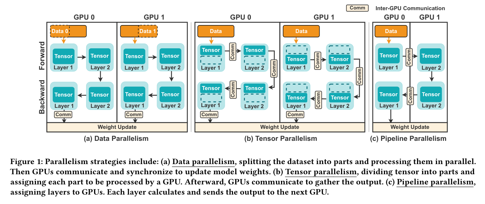
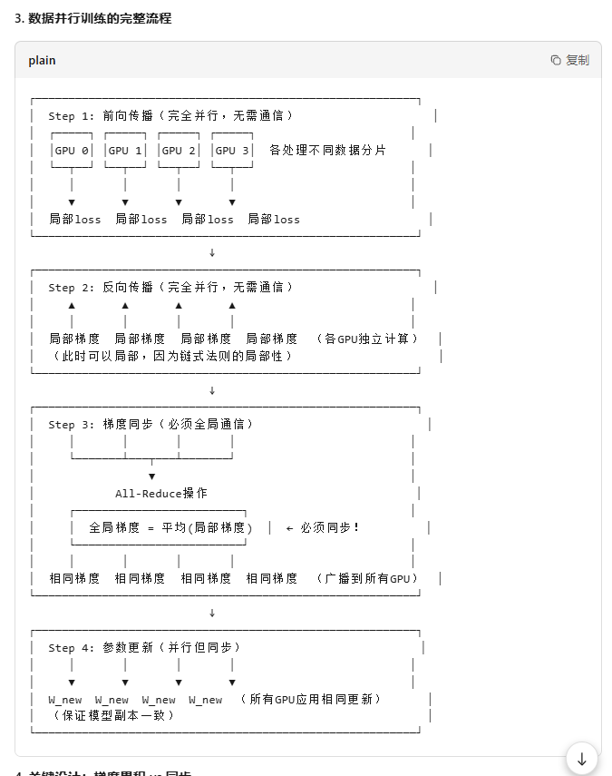

# 分布式并行策略

分布式并行策略的一些理解。

首先需要明确的是：**并不是所有并行策略在最后都需要做 all-reduce 全局梯度**。

更准确地说：

- **数据并行（Data Parallelism, DP）**：不同 GPU 持有同一份模型参数、处理不同的数据分片。为了保证各个副本的参数更新一致，在反向传播之后需要对梯度进行同步。常见实现方式是 **all-reduce**，也可以是 **reduce-scatter / all-gather** 等其他集合通信方式。
- **张量并行（Tensor Parallelism, TP）**：同一层的参数或计算被切分到多个 GPU 上，因此在前向传播和反向传播过程中就需要进行通信；它并不一定表现为“最后统一做一次全局梯度 all-reduce”。
- **流水线并行（Pipeline Parallelism, PP）**：不同 GPU 负责不同的网络层，主要通过微批次（micro-batch）实现流水执行。**流水线并行本身并不必然要求全局梯度 all-reduce**；只有在它与数据并行结合时，才通常需要在数据并行组内同步梯度。

下图节选自 [Triosim](https://dl.acm.org/doi/10.1145/3695053.3731082)，展示了三种不同的并行策略：

以**数据并行**为例，每个 GPU 在前向传播和反向传播时，只基于自己的局部 mini-batch 计算局部梯度。为了使所有模型副本保持一致，在参数更新之前，必须对这些局部梯度进行同步；实践中通常使用 **all-reduce** 来求和或求平均。

如果不进行梯度同步，那么每个 GPU 会依据各自的局部梯度独立更新参数，最终导致不同 GPU 上的模型参数逐渐偏离。这样一来，系统实际上就在并行训练多个彼此不一致的模型，而不是在协同训练同一个数据并行模型。

## Model 并行

### 张量并行
[张量并行](./tensor并行/张量并行.md)

### 流水线并行

### 3D 并行