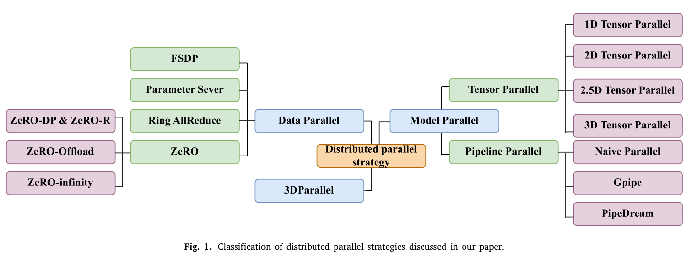

# 张量并行 (Tensor Parallelism)：矩阵的把戏

作为 LLM 训练分布式并行策略的一种，张量并行（Tensor Parallelism）属于模型并行（Model Parallelism）策略的一个子集。

具体而言，分布式并行策略的划分如下图。节选自论文[Distributed training of large language models: A survey](https://www.sciencedirect.com/science/article/pii/S2949719125000500)。

张量并行将模型参数划分到多个设备上，以减少内存负荷。按照划分方式，可以分为 1D 张量并行、2D 张量并行、2.5D 张量并行和3D 张量并行。

它们的区别，本质上就是：**把矩阵乘法 $Y=XA$ 里的哪些“维度/角色”分给不同 GPU 去做。**

注意，为了简洁易懂和，我们省略了 all-reduce, reducer-scatter, all-gather 这些操作的描述，仅在逻辑层面关注张量到底是如何划分到不同的处理器进行计算。

## 统一观察框架
我们始终看这件事：

$$Y = XA$$

其中：
- $X \in \mathbb{R}^{B \times H}$
- $A \in \mathbb{R}^{H \times O}$  
- $Y \in \mathbb{R}^{B \times O}$

对应到矩阵乘法元素级表达：

$$Y_{ij} = \sum_{h} X_{ih} A_{hj} = X_{i0} A_{0j}+X_{i1} A_{1j}+...+X_{ih} A_{hj}$$

### 观察视角1

对于 $Y_{ij} = \sum_{h} X_{ih} A_{hj}$ 这一部分，这里有三个角色：
- $i$：输出的行块
- $j$：输出的列块
- $h$：乘法中的**中间求和维**

你可以把整个演化理解成一句话：
- **1D**：只并行一个角色
- **2D**：并行两个角色
- **2.5D**：两个角色 + 一点复制冗余，减少通信
- **3D**：三个角色都并行

---

### 观察视角2

对于 $Y_{ij} = X_{i0} A_{0j}+X_{i1} A_{1j}+...+X_{ih} A_{hj}$ 这一部分，我们可以看成是 $h$ 次 $X_i A_j$ 的求和。***即对于输出 $Y_{ij}$ ，需要经过 $h$ 次内积才能得到。***

# 统一设定

计算：

$$
Y = XA
$$

设：

- $X \in \mathbb{R}^{4\times4}$
- $A \in \mathbb{R}^{4\times4}$
- $Y \in \mathbb{R}^{4\times4}$

如果按 $2\times2$ 小块分块：

$$
X=
\begin{bmatrix}
X_{00} & X_{01}\\
X_{10} & X_{11}
\end{bmatrix},\quad
A=
\begin{bmatrix}
A_{00} & A_{01}\\
A_{10} & A_{11}
\end{bmatrix}
$$

则：

$$
Y=
\begin{bmatrix}
Y_{00} & Y_{01}\\
Y_{10} & Y_{11}
\end{bmatrix}
$$

其中：

$$
Y_{00}=X_{00}A_{00}+X_{01}A_{10}
$$

$$
Y_{01}=X_{00}A_{01}+X_{01}A_{11}
$$

$$
Y_{10}=X_{10}A_{00}+X_{11}A_{10}
$$

$$
Y_{11}=X_{10}A_{01}+X_{11}A_{11}
$$

下面都用 **8 张卡** 举例。

---

# 1D 张量并行（8 张卡）

## 核心
只沿 **一个维度** 切。

最典型：按输出列切，也就是按 $A$ 的列切。

## 8 张卡怎么理解
因为这里只有 $4\times4$ 小矩阵，没法真实切成 8 份独立小块，所以这里只看“逻辑形式”：

把输出列方向切成 8 份，记作：

$$
A = [A^{(0)},A^{(1)},\dots,A^{(7)}]
$$

则：

$$
Y = [XA^{(0)},XA^{(1)},\dots,XA^{(7)}]
$$

## 每张卡做什么
第 $g$ 张卡做：

$$
Y^{(g)} = X A^{(g)}
$$

## 本质
- 每张卡负责一部分输出列
- 只并行了一个角色：**$j$**

---

# 2D 张量并行（8 张卡）

## 核心
把设备排成二维网格。  
8 张卡最自然是：

$$
4 \times 2
$$

记 GPU 为 $(i,j)$：

- $i\in\{0,1,2,3\}$
- $j\in\{0,1\}$

## 数学本质
并行两个角色：

- 输出行块 $i$
- 输出列块 $j$

## 用分块矩阵表示
如果按逻辑把 $X$ 的行分成 4 份、$A$ 的列分成 2 份，则每张卡 $(i,j)$ 负责：

$$
Y_{ij}
$$

并计算：

$$
Y_{ij} = \sum_l X_{il}A_{lj}
$$

## 对于上面的 $2\times2$ 分块小例子
为了看公式，可以只看 $2\times2$ 输出块：

- GPU $(0,0)$ 负责 $Y_{00}$
- GPU $(0,1)$ 负责 $Y_{01}$
- GPU $(1,0)$ 负责 $Y_{10}$
- GPU $(1,1)$ 负责 $Y_{11}$

即：

$$
Y_{00}=X_{00}A_{00}+X_{01}A_{10}
$$

$$
Y_{01}=X_{00}A_{01}+X_{01}A_{11}
$$

$$
Y_{10}=X_{10}A_{00}+X_{11}A_{10}
$$

$$
Y_{11}=X_{10}A_{01}+X_{11}A_{11}
$$

如果扩展到 8 张卡，本质不变，只是网格更细。

## 本质
- 每张卡负责一个输出块
- 并行了两个角色：**$i,j$**

## 记忆
- 2D = “把输出切成棋盘格”

---

# 2.5D 张量并行（8 张卡）（这里的例子还不够好）

## 核心
2D 并行 + 第三维做**复制**

8 张卡可排成：

$$
2 \times 2 \times 2
$$

记 GPU 为 $(i,j,k)$：

- $i\in\{0,1\}$
- $j\in\{0,1\}$
- $k\in\{0,1\}$

其中：

- $(i,j)$：2D 计算网格
- $k$：复制层

---

## 两层 2D 网格

### 第 0 层
- $(0,0,0)$
- $(0,1,0)$
- $(1,0,0)$
- $(1,1,0)$

### 第 1 层
- $(0,0,1)$
- $(0,1,1)$
- $(1,0,1)$
- $(1,1,1)$

---

## 关键点
第三维 $k$ **不是求和项索引**。  
它表示“第几层副本”。

也就是说：

- 第 0 层是一套 2D 计算网格
- 第 1 层也是一套 2D 计算网格
- 两层持有重复/部分重复的数据，减少通信

---

## 用矩阵公式看
例如：

$$
Y_{00}=X_{00}A_{00}+X_{01}A_{10}
$$

在 2.5D 中，不是说：

- $k=0$ 算第一项
- $k=1$ 算第二项

而是说：

- 第 0 层有一套数据布局，参与 $Y_{00}$ 的计算
- 第 1 层也可能有一套重复布局，帮助减少通信

所以：

- $(0,0,0)$ 和 $(0,0,1)$ 更像“两个副本层里的同位置卡”
- 不是“一个算左项，一个算右项”

---

## 本质
- 计算结构还是 2D
- 第三维主要用于**复制数据、减少通信**
- 并行本质仍是 **$i,j$**，第三维不是数学上的求和维

## 记忆
- 2.5D = “两层 2D 棋盘”
- “第三维是在多放几份”

---

# 3D 张量并行（8 张卡）

## 核心
8 张卡排成：

$$
2 \times 2 \times 2
$$

记 GPU 为 $(i,j,l)$：

- $i\in\{0,1\}$：输出行块
- $j\in\{0,1\}$：输出列块
- $l\in\{0,1\}$：求和维块

## 数学本质
直接对应：

$$
Y_{ij}=\sum_l X_{il}A_{lj}
$$

也就是：

- 第三维 $l$ 真正参与计算
- 每张卡 $(i,j,l)$ 算一个 partial sum

---

## 8 张卡分别算什么

| GPU | 计算内容 |
|---|---|
| $(0,0,0)$ | $X_{00}A_{00}$ |
| $(0,0,1)$ | $X_{01}A_{10}$ |
| $(0,1,0)$ | $X_{00}A_{01}$ |
| $(0,1,1)$ | $X_{01}A_{11}$ |
| $(1,0,0)$ | $X_{10}A_{00}$ |
| $(1,0,1)$ | $X_{11}A_{10}$ |
| $(1,1,0)$ | $X_{10}A_{01}$ |
| $(1,1,1)$ | $X_{11}A_{11}$ |

---

## 最后归约得到输出块

$$
Y_{00} = (0,0,0) + (0,0,1)
$$

即：

$$
Y_{00}=X_{00}A_{00}+X_{01}A_{10}
$$

$$
Y_{01} = (0,1,0) + (0,1,1)
$$

即：

$$
Y_{01}=X_{00}A_{01}+X_{01}A_{11}
$$

$$
Y_{10} = (1,0,0) + (1,0,1)
$$

即：

$$
Y_{10}=X_{10}A_{00}+X_{11}A_{10}
$$

$$
Y_{11} = (1,1,0) + (1,1,1)
$$

即：

$$
Y_{11}=X_{10}A_{01}+X_{11}A_{11}
$$

---

## 本质
- 并行了三个角色：**$i,j,l$**
- 第三维是真正的**求和维切分**

## 记忆
- 3D = “一个输出块里的加号两边，也拆给不同卡算”

---

# 四者最短对比

| 并行方式 | 8 张卡组织 | 第三维作用 | 数学本质 |
|---|---|---|---|
| 1D | 8 | 无 | 只切一个维度 |
| 2D | $4\times2$ | 无 | 并行 $i,j$ |
| 2.5D | $2\times2\times2$ | 复制层 | 2D + 冗余副本 |
| 3D | $2\times2\times2$ | 求和维 $l$ | 并行 $i,j,l$ |

---

# 最关键一句

- **2.5D**：第三维是“副本层”
- **3D**：第三维是“求和项层”
